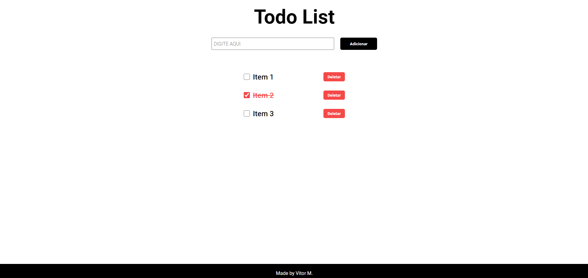
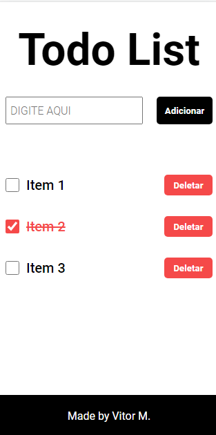

# Todo List

Uma aplicação de todo feito em html, css e javascript.

  

## SUMÁRIO

- Status
- Deploy
- Features
- Demonstração da Aplicação
- Como Rodar a Aplicação
- Pré Requisitos Para Rodar a Aplicação
- Tecnologias utilizadas
- Autor

## Status

✨Concluído ✨

## Deploy

- [https://vitor-mat.github.io/Todo-List/](https://vitor-mat.github.io/Todo-List/)

## Features

- Você pode adicionar quantos intem queira no seu todo.
- Site responsivo.
- o items marcados como concluídos possuem um efeito visual.
- Armazenamento dos cardas no LocalStorage.
- Você pode remover os items do seu storage.

## Demonstração da Aplicação

### Todo List Desktop

### Todo List Mobile

## Pré Requisitos Para Rodar a Aplicação

Você precisa simplesmente de um browser de internet (navegador).

## Como Rodar a Aplicação

Para Ver a aplicação, abri o index html no seu navegador de internet.

## Tecnologias Utilizadas

- [html](https://developer.mozilla.org/pt-BR/docs/Web/HTML)
- [css](https://developer.mozilla.org/pt-BR/docs/Web/CSS)
- [javscript](https://developer.mozilla.org/pt-BR/docs/Web/JavaScript)

## Autor

Feito por Vitor Mateus

 
